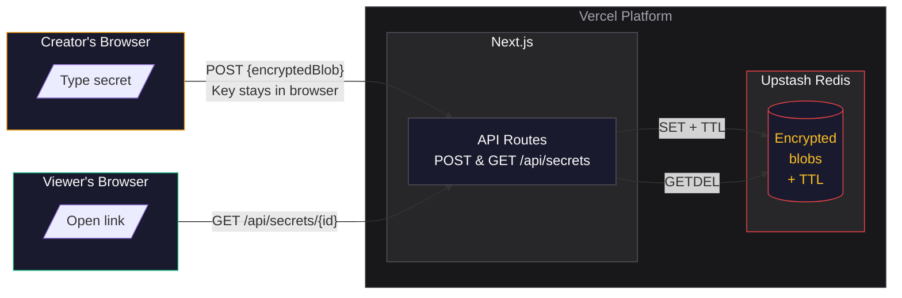
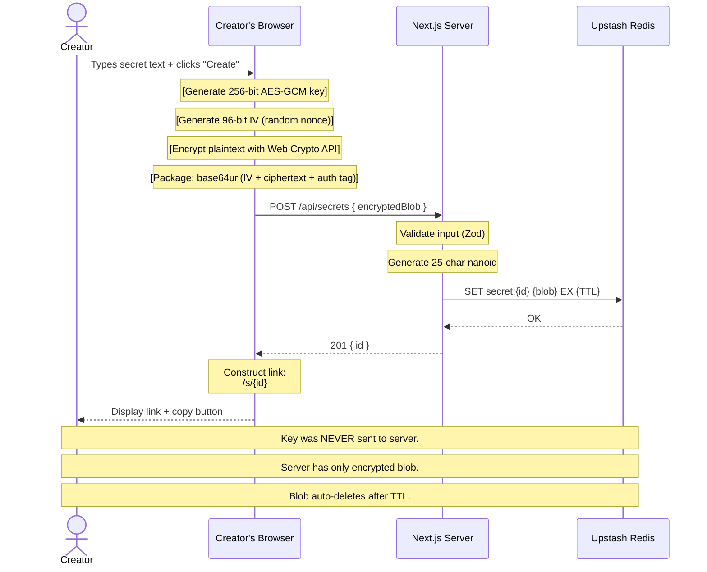
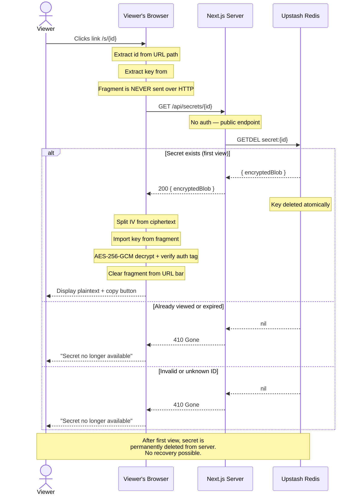
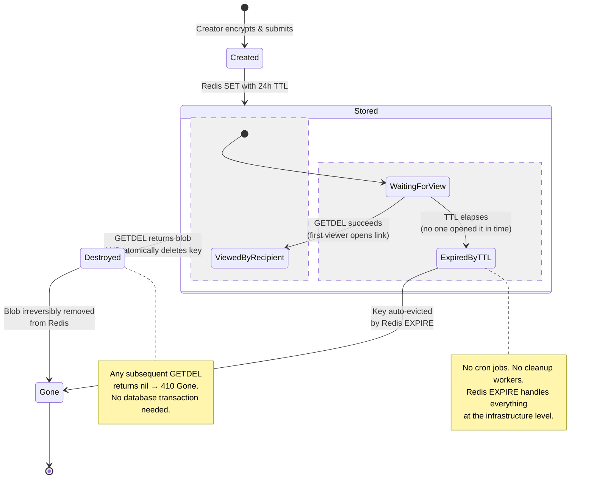

# Secret Manager

**Zero-knowledge, one-time secret sharing built for internal teams.**

Share passwords, API keys, credentials, and confidential text securely. Every secret is encrypted in the browser before it leaves your machine. The server never sees plaintext — it's a dumb courier holding encrypted blobs that self-destruct after 24 hours (or the first view, whichever comes first). No database. No user accounts. No audit trail. No trust in the server.

---

## Security Model

### What the Server Knows

| Question | Answer |
|---|---|
| Can the server read secrets? | **No.** All encryption happens client-side. The server only receives ciphertext. |
| Does the server have the decryption key? | **No.** The key lives exclusively in the URL fragment (`#...`), which browsers never transmit over HTTP. |
| Can a database breach expose secrets? | **No.** Encrypted blobs without keys are cryptographically useless. |
| Can an insider (admin, developer) read secrets? | **No.** AES-256-GCM encrypted data without the key is indistinguishable from random noise. |
| What CAN the server observe? | When secrets are created and at what rate. The IP addresses of viewers. Which IDs are accessed. **Content is invisible.** |

### Encryption Details

| Property | Implementation |
|---|---|
| **Algorithm** | AES-256-GCM (authenticated encryption) |
| **Key length** | 256 bits |
| **IV** | 96-bit random nonce, prepended to ciphertext |
| **Authentication** | GCM tag ensures ciphertext integrity — tampered blobs fail decryption |
| **Crypto library** | `window.crypto.subtle` (Web Crypto API) — browser-native, hardware-accelerated, **zero npm dependencies** |
| **Key storage** | Nowhere. The key lives in the URL fragment, extracted by the viewer's browser, then cleared from the address bar after decryption |

### Threat Model

| Threat | Mitigation | Effectiveness |
|---|---|---|
| Server/database compromise | All blobs are AES-256-GCM encrypted. Key was never on server. | **Full protection** |
| Network eavesdropper | TLS 1.3 in transit. Key in fragment never transmitted. | **Full protection** |
| Link leaked to wrong person | Anyone with the full URL can decrypt. No secondary auth factor. | **No protection** — this is the primary risk. Share links over secure channels. |
| Attacker guessing secret IDs | 25-character nanoid IDs (10³⁶+ address space). Even if guessed, `GETDEL` means only the first request succeeds. | **Strong protection** |
| Blob tampering in transit or storage | GCM authentication tag verified on decryption. Tampered blobs fail cleanly. | **Full protection** |
| Simultaneous viewers (race condition) | `GETDEL` is atomic — Redis returns the blob AND deletes it in a single operation. The second caller gets nothing. | **Full protection** |
| Browser history / memory | Fragment cleared via `history.replaceState()` after viewing. Plaintext removed from DOM on navigation. | **Strong —** inherent browser limitation |
| Malicious browser extension | Extensions can snapshot the DOM. | **No protection** — inherent client-side risk |

---

## Architecture

### System Architecture — Container Diagram



### Creator Flow — Sequence Diagram



### Viewer Flow — Sequence Diagram



### Security Trust Boundaries

```mermaid
flowchart LR
    subgraph Browser["Browser (Trusted)"]
        direction TB
        Plaintext["Plaintext Secret"]
        Key["AES-256 Key"]
        Crypto["Web Crypto API"]
        Fragment["URL Fragment']
        Encrypted["Encrypted Blob"]
        Plaintext --> Crypto
        Key --> Crypto
        Crypto --> Encrypted
        Key --> Fragment
    end

    subgraph Network["Network (TLS 1.3)"]
        TLS["Encrypted traffic only"]
    end

    subgraph Server["Server (Untrusted)"]
        direction TB
        API["API Routes"]
        DB[("Redis Store")]
        API -->|"SET / GETDEL"| DB
    end

    Browser -->|"POST {blob} | No key, no plaintext"| Network
    Network --> Server
    Server -->|"{blob} or 410 Gone"| Network
    Network --> Browser

    style Plaintext fill:#991b1b,stroke:#ef4444,color:#fca5a5
    style Key fill:#991b1b,stroke:#ef4444,color:#fca5a5
    style Fragment fill:#991b1b,stroke:#ef4444,color:#fca5a5
    style Encrypted fill:#14532d,stroke:#22c55e,color:#86efac
    style Browser fill:#1a1a2e,stroke:#f59e0b,color:#fafafa
    style Server fill:#18181b,stroke:#ef4444,color:#f87171
    style Network fill:#27272a,stroke:#3b82f6,color:#93c5fd
    style DB fill:#1a1a2e,stroke:#ef4444,color:#fbbf24
    style API fill:#1a1a2e,stroke:#52525b,color:#fafafa
```

### Secret Lifecycle — State Machine



---

## Efficiency: What We're NOT Running

This system is deliberately minimal. Every absent component is an intentional design choice.

| Removed | Why | What It Saves |
|---|---|---|
| **Database (Postgres/MySQL)** | No user records, no metadata, no history. Redis key-value is the exact data model needed. | No ORM, no migrations, no schema management, no connection pooling. |
| **ORM (Prisma/Drizzle)** | Nothing to map. Single key-value pair per secret. | Zero database abstraction overhead. |
| **User table / accounts** | No authentication needed for the core flow. SSO can be added as a thin middleware layer later. | No user management, no password resets, no session storage. |
| **Dashboard / search** | Fire-and-forget. Creator doesn't manage or recall secrets. | No list queries, no pagination, no filters. |
| **Audit logs** | Zero-knowledge design — server observes nothing beyond blob existence. | No log table, no retention policies, no log queries. |
| **Cron jobs / purge workers** | Redis's built-in `EXPIRE` evicts keys automatically. No manual cleanup. | No background job infrastructure, no dead-letter queues. |
| **Message queue / pub-sub** | Synchronous request-response. No async workflows needed. | No queue dependencies, no retry logic complexity. |
| **File uploads / chunked encryption** | Text-only by design. Files add chunking, streaming, and storage complexity. | Simpler crypto, simpler storage. |
| **Rate limiting layer** | `GETDEL` makes brute-forcing pointless — each ID works exactly once, then it's gone. The ID space is 10³⁶+. | No Redis rate limit counters, no IP tracking. |
| **WebSockets / real-time** | No collaborative editing, no live status updates needed. | Simpler server, no connection management. |

**Surface area**: 17 source files. 3 API endpoints. 1 persistent storage (Redis). Zero background jobs.

---

## System Design Principles Applied

### 1. Zero-Trust Architecture (Server is the Adversary)

The server is explicitly untrusted. Every component is designed on the assumption that the server is compromised. Encrypted blobs without keys are useless. This is the foundational design principle and drives every other decision.

**Applied in**: `lib/crypto.ts` (client-side encryption), URL fragment key delivery (key never reaches server), `GETDEL` (server cannot replay the blob).

### 2. Minimization of Attack Surface

The system has the smallest possible surface area for a secret-sharing application. No user accounts to hijack. No session tokens to steal. No database to exfiltrate. No audit logs to leak metadata. The only persistent state is encrypted ciphertext with a 24-hour shelf life.

**Applied in**: The entire architecture — 3 endpoints, 1 storage system, 0 background processes.

### 3. Defense in Depth

Multiple layers protect against different failure modes. TLS protects the transport. GCM authentication protects against tampering. One-time `GETDEL` protects against replay. URL fragment isolation protects against server-side key leakage. Even if one layer fails, others hold.

**Applied in**: TLS → GCM auth tag → GETDEL atomicity → fragment isolation → TTL auto-expiry.

### 4. Single Responsibility

Each component has exactly one job. `crypto.ts` encrypts and decrypts. `redis.ts` initializes a client. API routes validate input and relay to Redis. Components manage their own state and UI. No file mixes concerns.

**Applied in**: Module structure — `lib/`, `app/api/`, `components/` each contain files with single, well-defined purposes.

### 5. Statelessness (Server Side)

The Next.js server is stateless between requests. All persistent state is in Redis. Route handlers create and retrieve keys without maintaining any session, cache, or in-memory state. This makes the system trivially horizontally scalable — any instance can handle any request.

**Applied in**: Route handlers call Redis on every request. No in-memory maps, no file-based storage, no sticky sessions.

### 6. Fail-Safe Defaults

When things go wrong, the system errs on the side of denying access. A missing fragment shows an error, not a blank page. A consumed secret shows "expired," not a cryptic 500. An invalid POST body gets a clear validation error with field-level detail.

**Applied in**: Zod validation with specific error messages, `410` for consumed/expired secrets, distinct error states in `SecretViewer` (`loading | decrypted | expired | error`).

### 7. Least Privilege

The server's Redis client can only `SET` and `GETDEL`. It cannot list keys, scan the database, or perform admin operations. The server has access to encrypted blobs and nothing else — no plaintext, no keys, no user data.

**Applied in**: Upstash Redis credentials with minimal permissions. API routes only execute `set` and `getdel`.

### 8. Composition over Inheritance

The system composes small, focused components rather than building a monolithic service. `SecretForm` + `LinkDisplay` compose the creator page. `SecretViewer` stands alone on the viewer page. Each component manages its own state and composes with the crypto library.

**Applied in**: React component composition — `page.tsx` renders `SecretForm` and conditionally renders `LinkDisplay`. No prop drilling chains, no context providers.

### 9. Idempotency

`GETDEL` is inherently idempotent — the second call returns null, which maps cleanly to a `410` response. The `SET` operation with a random ID guarantees no collisions. There's no need for retry logic because duplicate requests naturally produce consistent results.

**Applied in**: API route design — `GETDEL` semantics, nanoid collision resistance.

### 10. Data Soverignty / Local-First

Data leaves the user's browser only after encryption. The plaintext never exists outside the user's machine. The decryption key is generated locally and never shared with any server. This respects the principle that sensitive data should be under the user's control.

**Applied in**: `SecretForm.tsx` (generates key and encrypts before any network call), `SecretViewer.tsx` (decrypts entirely client-side).

---

## Tech Stack

| Layer | Technology | Version |
|---|---|---|
| **Framework** | Next.js (App Router) | 16 |
| **Runtime** | React | 19 |
| **Language** | TypeScript | 5 |
| **Styling** | Tailwind CSS | 4 |
| **Storage** | Upstash Redis (serverless) | — |
| **Crypto** | Web Crypto API (browser-native) | — |
| **Validation** | Zod | 3 |
| **ID Generation** | nanoid | 5 |
| **Icons** | Lucide React | — |
| **Deployment** | Vercel | — |

---

## Getting Started

### Prerequisites

- Node.js 20+
- An [Upstash Redis](https://console.upstash.com) database (free tier works)

### Setup

```bash
# 1. Clone and install
cd secret-manager
npm install

# 2. Configure environment
cp .env.example .env.local
```

Edit `.env.local` with your Upstash credentials:

```bash
UPSTASH_REDIS_REST_URL=https://your-db.upstash.io
UPSTASH_REDIS_REST_TOKEN=your_token_here

# Optional: secret TTL in seconds (default: 86400 = 24 hours)
# For testing, set to 60 (1 minute)
SECRET_TTL_SECONDS=86400
```

### Run Locally

```bash
npm run dev
# Open http://localhost:3000
```

### Deploy to Vercel

1. Push to GitHub
2. Import the repo into Vercel
3. Add the three environment variables from `.env.local` in Vercel's project settings
4. Deploy

For production, set `SECRET_TTL_SECONDS=86400` (or omit it — 24 hours is the default).

---

## File Structure

```
secret-manager/
├── app/
│   ├── layout.tsx                 # Root layout, JetBrains Mono font, dark theme
│   ├── page.tsx                   # Creator page: SecretForm → LinkDisplay
│   ├── globals.css                # Terminal noir theme (amber on zinc)
│   ├── not-found.tsx              # Custom 404 page
│   ├── s/
│   │   └── [id]/
│   │       └── page.tsx           # Viewer page: SecretViewer
│   └── api/
│       └── secrets/
│           ├── route.ts           # POST — create secret (SET with TTL)
│           └── [id]/
│               └── route.ts       # GET — view secret (GETDEL, one-time)
│
├── components/
│   ├── SecretForm.tsx             # Textarea → encrypt → POST → construct link
│   ├── SecretViewer.tsx           # Fetch blob → extract key → decrypt → display + copy
│   └── LinkDisplay.tsx            # Show generated link + copy button + expiry warning
│
├── lib/
│   ├── crypto.ts                  # Web Crypto wrapper — AES-256-GCM encrypt/decrypt
│   ├── redis.ts                   # Lazy Upstash Redis client singleton
│   ├── validators.ts              # Zod schema — secret validation (200KB limit)
│   └── types.ts                   # Shared TypeScript types
│
├── middleware.ts                  # (Reserved for future auth gating)
├── next.config.ts                 # CSP headers, security configuration
├── tailwind.config.ts             # Tailwind v4 theme
├── .env.example                   # Documented environment variable template
└── .env.local                     # Your local environment (gitignored)
```

---

## Why These Choices

### Why Redis and not a database?

The data model is exactly one key-value pair per secret. A relational database would require a schema, migrations, an ORM, and connection pooling — all for a single `TEXT` column accessed by primary key. Redis's `SET` with `EX` (TTL) and `GETDEL` (atomic read-delete) map 1:1 to the system's requirements without any mapping layer.

### Why Route Handlers and not Server Actions?

Per Next.js best practices, Route Handlers are the correct choice for public API endpoints consumed by external clients (the viewer's browser). Server Actions are designed for form submissions from your own UI, use POST-only, and cannot be cached. The viewer endpoint is a public GET request from an anonymous client — a Route Handler is the natural fit.

### Why no authentication?

The security model relies on encryption, not access control. The link IS the access. Adding authentication would create a false sense of security — an authenticated but unauthorized user with the link could still decrypt the secret. Until SSO is needed for the creator dashboard, authentication adds complexity without adding security.

### Why URL fragment for key delivery?

The fragment (`#...`) is the only part of a URL that browsers never include in HTTP requests. It's invisible to the server, to proxies, to server logs, and to the `Referer` header. This is the standard pattern for zero-knowledge sharing (used by One-Time Secret, Yopass, and Bitwarden Send).

### Why GETDEL instead of GET + DELETE?

Two separate operations create a race condition: if two viewers open the link at the exact same time, both could receive the blob before either deletes it. `GETDEL` is a single atomic Redis command that returns the value AND deletes the key in one operation. The second caller always receives null. No database transactions, no distributed locks, no retry logic needed.

### Why nanoid for IDs?

UUIDs work but are 36 characters. nanoid produces 25-character URL-safe IDs with higher entropy per character. The 25-character alphabet provides ~10³⁶ possible IDs — more than enough to prevent enumeration even without rate limiting. Plus, nanoid is faster and produces shorter URLs.

---

## License

Internal tool. No license.
